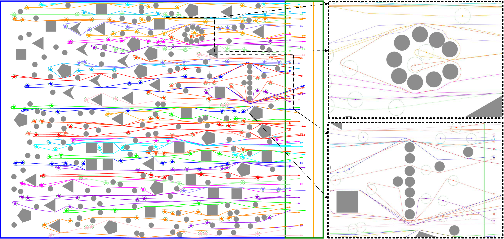
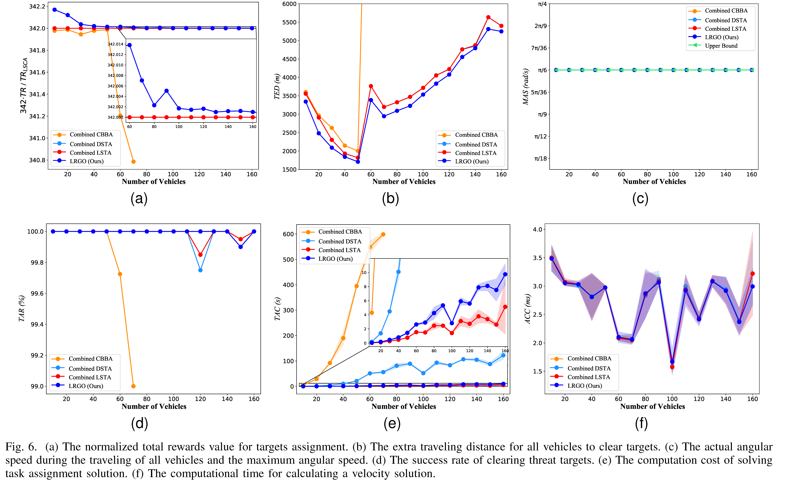

## Distributed Multi-vehicle Task Assignment and Motion Planning in Dense Environments
Python Implementation of multi-vehicle task assignment and motion planning (MVTAMP), including task assignment algorithms: consensus-based bundle algorithm ( [CBBA](https://ieeexplore.ieee.org/stamp/stamp.jsp?tp=&arnumber=5072249)), lazy sample-based task allocation ([LSTA](https://ieeexplore.ieee.org/stamp/stamp.jsp?tp=&arnumber=8798293)), decentralized sample-based task allocation ([DSTA](https://link.springer.com/article/10.1007/s11721-022-00213-0)), and our lazy-based review consensus algorithm (LRCA); motion planning algorithms: optimal reciprocal collision avoidance ([ORCA](http://gamma-web.iacs.umd.edu/ORCA/publications/ORCA.pdf)), [D*](https://ieeexplore.ieee.org/stamp/stamp.jsp?tp=&arnumber=351061), and our guidance point strategy ([GOS](https://ieeexplore.ieee.org/stamp/stamp.jsp?tp=&arnumber=10328899)). Finally, a novel hierarchical method, [LRGO](https://ieeexplore.ieee.org/stamp/stamp.jsp?tp=&arnumber=10328899), for solving the MVTAMP applied in non-holonomic vehicles  is presented in this repository.

-----

Description
-----

We present an novel method for solving the multi-vehicle task assignment and motion planning (MVTAMP) problem for non-holonomic vehicles, in which a fleet of non-holonomic vehicles is assigned to visit a series of targets to clear them efficiently, and each vehicle needs to travel to a specific ending area once it finished all missions in the shortest possible time.

About
-----

**Paper**:  [Distributed Multi-vehicle Task Assignment and Motion Planning in Dense Environments](https://ieeexplore.ieee.org/abstract/document/10328899), Gang Xu, Xiao Kang, Helei Yang, Yuchen Wu, Junjie Cao,  Weiwei Liu, and Yong Liu, in IEEE Transactions on Automation Science and Engineering (T-ASE) 2023

**Vedio:** [LRGO-Demo](https://www.youtube.com/watch?v=YWv7Rg3BZpw)


-----

Requirement
-----

```python
pip install pandas
pip install random
pip install heapq
pip install scipy
pip install json
pip install collections
pip install matplotlib
```

-----

Applications
-----

```python
Phase 1:
cd run_example
python run_exam_lrgo.py   
In the file run_example, you can select the pyhton scripts to test different scenarios. 

Phase 2: Visualization
cd draw
python annimate.py
```

## Results

- #### The first simulation: 50 vehicles visit 203 targets for clearing them and move to the start area.

<p align="center">
    
</p>

- 
  #### The results of evaluation.


<p align="center">
    
</p>

- #### The first real-world experiment: 5 vehicle visit 11 targets.


<p align="center">
    
</p>

- #### The first real-world experiment: 5 vehicle visit 11 targets and move to the start area.


<p align="center">
    
</p>


----

## Citation

```
@article{xuDistributedMultiVehicleTask2023,
  author={Xu, Gang and Kang, Xiao and Yang, Helei and Wu, Yuchen and Liu, Weiwei and Cao, Junjie and Liu, Yong},
  journal={IEEE Transactions on Automation Science and Engineering}, 
  title={Distributed Multi-Vehicle Task Assignment and Motion Planning in Dense Environments}, 
  year={2024},
  month = oct,
  volume={21},
  number={4},
  pages={7027-7039},
  doi={10.1109/TASE.2023.3336076}}
```
